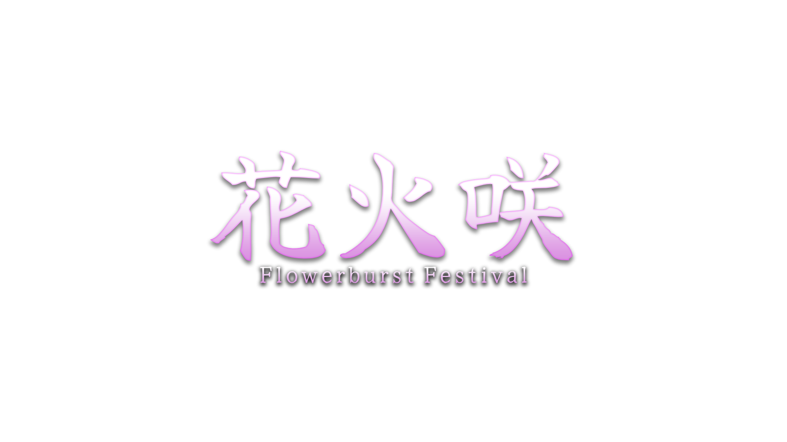

# Hanabisaki: Flowerburst Festival

Basic WebGL Bullet hell game inspired by Touhou Project. Currently in development, expect a lot of bugs and placeholder stuff for now.
[Play here](https://rateater93.itch.io/danmaku)

> A village is famous for its magical fireworks competition, except this year, the event merged with the town’s flower show and sports day (by mistake).

> Play as Hanaoka Hibiki, a popular dodgeball athlete that likes flowers, where she got involved in the chaotic competition, and she must accept their challenge by playing fireworks dodgeball. No one knows how a "fireworks dodgeball" work, but that's part of the fun and chaos.